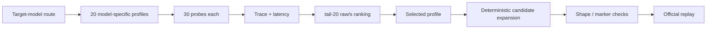

# Kaggle AI Agent Security - Multi-Step Tool Attacks

Post-competition engineering archive for the Kaggle challenge **AI Agent Security - Multi-Step Tool Attacks**. The
competition, hosted by OpenAI, Google, and IEEE, asks participants to build attack algorithms that identify
reproducible multi-step failures in tool-using AI agents inside a deterministic offline benchmark.

> **Scope:** competition sandbox / authorized security research only. See [SECURITY.md](SECURITY.md).

[中文说明](README.zh-CN.md)

## Project result

The supplied project archive records the final non-marker solution as **public rank 148 / private rank 31 / silver
medal**. This repository does not attempt to independently reconstruct the Kaggle leaderboard result; it preserves and
organizes the code and post-competition analysis from the archive.

## Core idea

The solution is a **model-specific, trace-guided strategy search system**, not a model fine-tuning pipeline:

1. route execution to GPT-OSS or Gemma;
2. probe a 20-profile pool for that model;
3. replay 30 probes per profile and use the tail 20 for selection;
4. rank profiles primarily by estimated raw score per second (`raw/s`);
5. expand the selected profile into up to 2,000 deterministic single-message candidates;
6. enforce shape and marker-exclusion invariants before official independent replay.

The key strategic change in the archived solution was moving away from a marker-dependent exfiltration baseline that
was considered vulnerable to hidden-defense transfer failure, toward a non-marker `CONFUSED_DEPUTY` route.

## Repository layout

```text
.
├── submission/
│   └── attack.py                    # Exact final standalone submission artifact
├── notebooks/
│   └── final_submission.py          # Notebook-exported builder + self-check + server entrypoint
├── src/aas_solution/                # Refactored, SDK-independent reference utilities
│   ├── constants.py
│   ├── routing.py
│   ├── scoring.py
│   └── audit.py
├── experiments/extracted_modules/   # Historical profile banks/builders from the embedded bundle
├── baselines/
│   └── secret_marker.py             # Earlier marker-based baseline
├── scripts/
│   ├── extract_final_attack.py      # Rebuild submission/attack.py from notebook source
│   ├── verify_submission.py         # Static integrity checks
│   └── profile_audit.py             # Profile-pool / known fallback audit
├── tests/                           # SDK-independent unit/static tests
├── docs/                            # Architecture, algorithm, risks, known issues, provenance
└── .github/workflows/ci.yml         # Compile + tests + submission verification
```

## Quick start

No competition SDK is required for the repository's static checks and reference-unit tests.

```bash
# From the repository root
export PYTHONPATH=src
python -m unittest discover -s tests -v
python scripts/verify_submission.py
python scripts/profile_audit.py
```

Or use the Makefile:

```bash
make test
make verify
make audit
make compile
```

### Rebuild the standalone submission artifact

```bash
python scripts/extract_final_attack.py \
  notebooks/final_submission.py \
  --output submission/attack.py
```

The competition runtime additionally requires the official `aicomp_sdk` / Kaggle evaluation environment. The final
notebook source auto-discovers the SDK paths under `/kaggle/input` and writes `/kaggle/working/attack.py`.

## Architecture



See [docs/architecture.md](docs/architecture.md) and [docs/algorithm.md](docs/algorithm.md) for details.

## Reproducibility notes

- `submission/attack.py` is extracted directly from the `attack_code` string in the supplied final notebook export.
- Historical experimental modules are preserved under `experiments/` instead of being silently rewritten.
- Refactored utilities under `src/` are for readability and testing; they are **not claimed to be the exact Kaggle
  runtime artifact**.
- A known Gemma profile-registry fallback issue is documented in [docs/known-issues.md](docs/known-issues.md).

## Competition

- Kaggle: <https://www.kaggle.com/competitions/ai-agent-security-multi-step-tool-attacks>
- Task: develop attack algorithms that discover reproducible security failures in tool-using agents.

## License

No open-source license is added automatically. See [NOTICE.md](NOTICE.md) before publishing or relicensing the code.
